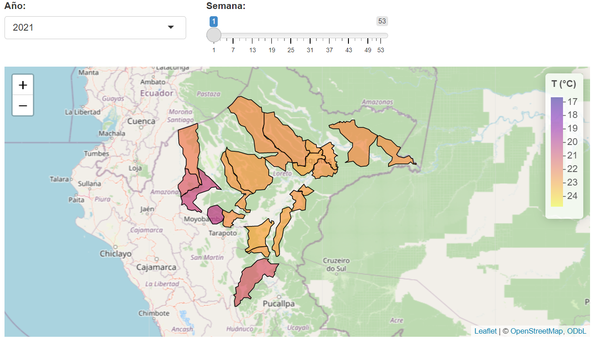

# DataChallenge . Dengue

Este repositorio contiene un proyecto de R Markdown en el que se han desarollado los ejercicios.
Para visualizar el mapa interactivo, debe ejecutarse el shiny app de la carpeta "app"

